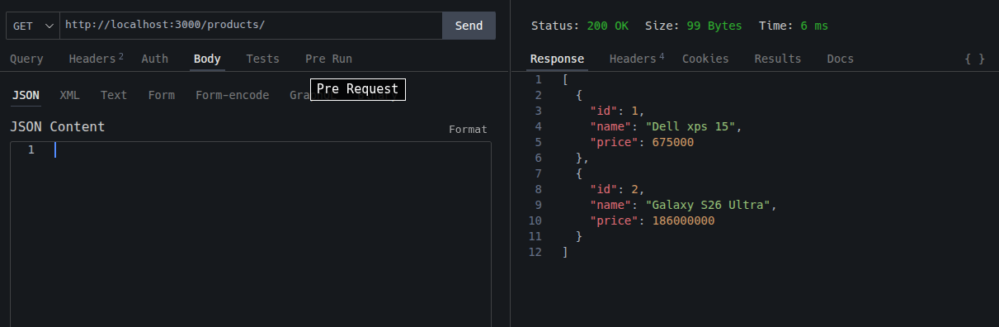

# API CRUD de Produtos – Node.js Nativo (Versão Básica)



Uma API REST simples de gerenciamento de produtos construída **exclusivamente com módulos nativos do Node.js** (sem Express, Fastify ou qualquer framework).

**Objetivo principal**: didático  
Esta implementação serve como material de estudo e demonstração de como funciona um servidor HTTP do zero em Node.js, incluindo:

- Ciclo de requisição/resposta
- Parsing manual de URL
- Leitura assíncrona do body (eventos `data` + `end`)
- Implementação manual de rotas e verbos HTTP
- Manipulação de estado em memória
- Respostas padronizadas em JSON

É a **versão 1/3** de um projeto intencionalmente evoluído em branches separadas:

| Branch        | Nível          | Principais melhorias planejadas                                                                 |
|---------------|----------------|--------------------------------------------------------------------------------------------------|
| `main` / `basic`     | Básico         | http nativo + array em memória (esta versão)                                                    |
| `intermediate`       | Intermediário  | Validações, query params, persistência em arquivo, error handling centralizado, middlewares manuais |
| `advanced`           | Avançado       | Banco de dados (SQLite ou MongoDB), autenticação JWT, rate limiting, testes (Jest/Supertest), logging estruturado |

## Endpoints Implementados

| Método | Endpoint              | Descrição                              | Corpo (JSON) exemplo                              | Status Sucesso | Resposta principal                          |
|--------|-----------------------|----------------------------------------|---------------------------------------------------|----------------|---------------------------------------------|
| GET    | `/products/`          | Lista todos os produtos                | —                                                 | 200            | Array de produtos                           |
| GET    | `/products/:id`       | Busca produto por ID                   | —                                                 | 200 / 404      | Objeto do produto ou erro                   |
| POST   | `/products/`          | Cria um novo produto                   | `{ "name": "iPhone 16", "price": 1200000 }`       | 201            | Objeto criado + mensagem                    |
| PUT    | `/products/id`       | Atualiza produto (atualização parcial) | `{ "price": 950000 }`                             | 200 / 404      | Produto atualizado                          |
| DELETE | `/products/id`       | Remove produto                         | —                                                 | 204 / 404      | Sem corpo (204) ou erro                     |

## Como Executar

```bash
# 1. Clone o repositório
git clone https://github.com/SEU-USUARIO/api-produtos-node-basico.git
cd api-produtos-node-basico

# 2. (Opcional) use a versão básica
git checkout main

# 3. Inicie o servidor
node server.js
# ou: node index.js  (dependendo do nome do arquivo)

# Servidor disponível em:
http://localhost:3000/products/ 

```
# Estrutura de Arquivos (atual)
```
├ api-http 
    ├── server.js          # (ou index.js) – código principal da API
    ├── README.md          # esta documentação
    └── .gitignore
```

# Decisões Didáticas Importantes

- Uso intencional de http puro para mostrar o que frameworks escondem
- Leitura do body via eventos stream (data + end) em vez de express.json()
- Parsing manual de ID via path.split() e parseInt
Respostas sempre em JSON com Content-Type fixo
- Status HTTP semanticamente corretos (201, 204, 404…)
- Tratamento mínimo de erro (foco em aprendizado, não em produção)

# Limitações Conhecidas (intencionais nesta versão)

* Dados voláteis (perdidos ao reiniciar o servidor)
* Ausência de validação de entrada
* Sem tratamento de erros globais / try-catch centralizado
* Sem suporte a query strings ou paginação
* Parsing de URL muito simples (pode quebrar com paths inesperados)

> *Essas limitações são resolvidas intencionalmente nas próximas **branches**.*

